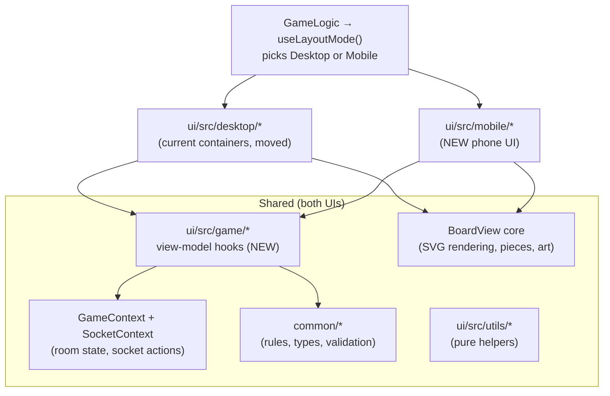

# Separate Mobile UI — Implementation Plan

Chosen approach: **Option B** from `plans/MOBILE_PLAN.md` — a dedicated phone
UI that shares all game state, socket actions, and rules with desktop, but has
its own layout and components designed for one-handed, touch-only play.

Target: a 375 px-wide phone in portrait can play a full game (setup → dice →
build/trade → soldiers/battles → win) against desktop players.

---

## 1. Principles

1. **One source of truth for game logic.** Rules already live in `common`
   (`canBuildSettlementAt`, `canBankTrade`, `canMoveSoldierTo`, …). What does
   *not* live there yet is the UI-side derived state that desktop components
   compute inline (which offers are incoming, whether you can roll, what the
   turn hint says). That moves into shared hooks **before** any mobile screen is
   built. Mobile and desktop components then only render.
2. **Components are per-platform; hooks and utils are shared.** A mobile
   component may never re-implement a rule or a filter that a desktop component
   also needs — it calls the same hook.
3. **Desktop is untouched except for the extraction refactor.** Each extraction
   is behavior-preserving and verified on desktop before mobile uses it.
4. **Mobile ships behind a switch** until it reaches feature parity, so it can
   land incrementally without affecting players.

---

## 2. Architecture



### 2.1 Folder layout

```
ui/src/
  contexts/            shared — unchanged (GameContext, SocketContext)
  game/                NEW shared view-model hooks (no JSX)
    useTurn.ts
    useTrade.ts
    useDiscard.ts
    useSteal.ts
    useDevCards.ts
    useBattle.ts
    useVertexActions.ts / useEdgeActions.ts
    useNotices.ts
    useLayoutMode.ts
  board/               shared board core (moved from containers/components)
    BoardView.tsx, layers, pieces, useBoardViewport, useBoardDrag
  desktop/             current desktop screens (moved, then slimmed)
    Game.tsx, SideBar/*, prompts, BattleModal, overlays
  mobile/              NEW phone UI
    MobileGame.tsx
    TopBar.tsx, BottomTabs.tsx, ActionSheet.tsx, PhaseButton.tsx
    sheets/            VertexSheet, EdgeSheet, TradeScreen, PlayersScreen,
                       DiscardSheet, StealSheet, DevCardSheet, BattleScreen
  pages/               Lobby, waiting room (shared, made responsive — see §6)
  components/, utils/  shared presentational pieces + pure helpers
```

Moving files is a mechanical step done in its own commit so reviews stay
readable (`git mv`, update imports, no logic changes).

### 2.2 Choosing the layout — `useLayoutMode()`

```ts
type LayoutMode = 'desktop' | 'mobile';
```

Resolution order:
1. `?ui=mobile` / `?ui=desktop` query param, persisted to `localStorage`
   (`ui.layout`), so testers and players can force either.
2. Otherwise `matchMedia('(max-width: 900px) and (pointer: coarse)')` →
   `mobile`; everything else → `desktop`. Tablets in landscape get desktop.
3. Re-evaluated on `resize`/`orientationchange`, but **only switches between
   games**, never mid-game — a phone rotating to landscape keeps the mobile UI
   (the mobile layout supports landscape, §4.6).

A "Switch to desktop/mobile layout" item goes in each UI's ☰ menu.

`GameLogic` renders `<MobileGame/>` or the desktop `<Game/>` based on the mode.
The lobby, name entry, and waiting room stay shared (§6).

---

## 3. Phase 0 — Extract shared view-model hooks (desktop refactor)

This is what keeps two UIs from drifting. Each hook returns plain data and
action callbacks, no JSX. The desktop component is rewritten to call the hook,
and must behave identically afterwards.

| Hook | Extracted from | Returns |
|---|---|---|
| `useTurn()` | `SideBar/EndTurnButton.tsx`, `TurnOverlay.tsx`, `NoticeRail.tsx` | `phase`, `isMyTurn`, `actingPlayer`, `setupRound (1/2)`, `setupNeeds[]`, `sevenPending`, `soldiersWithActionsLeft`, `primaryAction: { label, enabled, reason, run }` (Roll / End turn / nothing), `hint` text |
| `useTrade()` | `SideBar/TradeTab.tsx` (8 `useState`s + filters) | `incoming`, `openOffers`, `outgoing`, `isTurnOwner`, bank form state + `bankCheck`, offer form state + `offerCheck`, `accept/decline/cancel/take/submit*` |
| `useDiscard()` | `DiscardPrompt.tsx` | `active`, `required`, `counts`, `inc/dec`, `canConfirm`, `confirm`, `waitingOn[]` |
| `useSteal()` | `StealPrompt.tsx` | `active`, `victims[]` with card counts, `selectedVictim`, `choose` |
| `useDevCards()` | `ResourceDisplay.tsx` (buy/play) + `DevCardPrompt.tsx` | `cards[]` with `playable/reason`, `buyCheck`, `buy`, `play(i)`, pending Year-of-Plenty/Monopoly choice + `resolve` |
| `useBattle()` | `containers/BattleModal.tsx` | `battle`, `phase`, sides, `canRoll(s)`, `roll`, `canContinue`, `continue/end/exit`, matchup + outcome (already pure in `utils/battleModal.ts`), reposition (`useBattleReposition`, already a hook) |
| `useVertexActions(vertexId)` | `SideBar/Vertex.tsx` + `useVertexGroup.ts` (already a hook) | settlement/city/recruit `BuildCheck`s + actions, heal, group selection, move targets, attack/capture/fight-robber |
| `useEdgeActions(edgeId)` | `SideBar/Edge.tsx` | road info, `roadCheck`, `build` |
| `useNotices()` | `NoticeRail.tsx`, `GameLogic.tsx` toast/notice timers | ordered list of current notices + transient toasts |

Rules of the refactor:
- One hook per commit; desktop checked by hand for that feature after each.
- No behavior change. Wording stays; only the location of the logic moves.
- `useBuildRules` and `useVertexGroup` already have the right shape — reuse,
  don't rewrite.

**Done when:** every desktop container that talks to the socket or derives
game state does so only through a `game/*` hook or an existing hook.

---

## 4. Mobile UI design

### 4.1 Screen structure (portrait)

```
┌──────────────────────────────┐
│ TopBar: turn · phase · VP    │  ~48px, safe-area top
│ [player chips, scrollable]   │
├──────────────────────────────┤
│                              │
│         Board (SVG)          │  fills remaining height
│   pinch zoom · drag pan      │
│   tap vertex/edge/soldier    │
│                              │
│              [ Resources ▾ ] │  compact floating chip
├──────────────────────────────┤
│   ActionSheet (contextual)   │  slides up on selection
├──────────────────────────────┤
│  [ PhaseButton: Roll / End ] │  big primary action, thumb zone
│ Board · Trade · Players · ☰  │  BottomTabs, safe-area bottom
└──────────────────────────────┘
```

- **TopBar** — whose turn, phase, your VP / points to win, player color chips
  (tap a chip → Players tab scrolled to that player). Uses `useTurn()`.
- **Board** — the shared `BoardView` core in a full-bleed container, with the
  touch input from `MOBILE_PLAN.md` §1.1–1.3 (pinch/pan, tap-to-select,
  enlarged hit areas).
- **Resources chip** — collapsed: five icons with counts in one row. Tap →
  expands to the full hand + dev cards (uses `useDevCards()`).
- **ActionSheet** — a bottom sheet that appears when you tap something:
  - vertex → `VertexSheet` (build settlement/city, recruit, heal, soldiers here,
    move/attack/capture) via `useVertexActions`
  - edge → `EdgeSheet` (build road) via `useEdgeActions`
  - your soldier → selected; valid move targets glow on the board; tap one to
    move (sheet shows "Move 2 soldiers to b · Cancel")
  - two snap points: *peek* (title + primary button) and *expanded*. Drag-down
    or tap the board background to dismiss.
- **PhaseButton** — the single most important action right now, from
  `useTurn().primaryAction`: "Roll dice", "End build phase", "End turn",
  "Place settlement + road (1/2)". Disabled state shows its reason on tap (the
  same `BuildCheck` reason pattern desktop uses).
- **BottomTabs** — Board (default) · Trade (badge = incoming offers) ·
  Players · ☰ (room code + copy link, switch layout, leave game).

### 4.2 Full-screen flows

These take over the screen instead of floating over the board:

| Flow | Mobile screen | Shared hook |
|---|---|---|
| Trade | `TradeScreen`: segmented control *Bank · Players · Offers*; big ± steppers (44 px) | `useTrade` |
| Players | `PlayersScreen`: one card per player (resources count, VP, army/road bonuses, dev cards) | existing `PlayersList` data |
| 7 rolled — discard | `DiscardSheet`: full-height, resource rows with ± and a live "3 of 4 selected" | `useDiscard` |
| Robber move | Board mode: valid hexes glow, banner "Tap a hex to move the robber" | `useBoardDrag` robber target logic |
| Steal | `StealSheet`: pick victim, then a card | `useSteal` |
| Dev card choice | `DevCardSheet` (Year of Plenty / Monopoly pickers) | `useDevCards` |
| Battle | `BattleScreen`: full-screen; mini-map on top, your troops as large tap-to-roll buttons below, round results as a list; repositioning uses the existing tap-to-assign rail | `useBattle` |
| Victory | reuse `VictoryOverlay` (already simple) | — |

### 4.3 Dice

No giant floating dice over the board. The PhaseButton becomes "Roll dice";
the result animates in the TopBar (two small dice + total) and lit hexes
flash on the board. The "It's your turn" toast becomes a TopBar pulse plus an
optional vibration (`navigator.vibrate`, Android only).

### 4.4 Touch interaction rules

- Tap = select. Drag on the board = pan, never moves pieces on mobile.
  (Drag-to-move stays on desktop.)
- Every action that spends resources or ends your turn is a button in the
  sheet or PhaseButton, never a gesture.
- Minimum 44×44 px targets; primary actions in the bottom third of the screen.
- Long-press a hex/vertex → info tooltip (resources it produces, owner) —
  replaces desktop hover.

### 4.5 Visual system

- Reuse the art, colors, and Tailwind tokens; mobile gets its own spacing scale
  (larger type: 15–16 px body, 13 px minimum).
- Sheets: rounded top corners, grab handle, backdrop only for full-screen flows.
- Motion: sheet slide ≤ 200 ms; respect `prefers-reduced-motion`.

### 4.6 Landscape phone

Board on the left, the ActionSheet docks as a right panel (~40% width), TopBar
collapses into the panel header, BottomTabs become a vertical rail. Same
components, different container — no separate code path.

### 4.7 Optional variant — no sidebar, controls on the map

An alternative to the ActionSheet (§4.1): the map is the whole screen and
every board action appears **as buttons on the map, next to what you tapped**.
There is no sidebar and no bottom sheet. It uses the same `game/*` hooks, so it
can be built instead of, or later swapped with, the sheet design.

```
┌──────────────────────────────┐
│ ● Alice's turn · BUILD  3/10 │  thin status pill (top)
│                              │
│          ╭──────────╮        │
│          │ 🏠 Build │        │  radial / pill buttons
│     ⬡ ●──┤ 🏰 City  │        │  anchored to the tapped vertex,
│          │ ⚔ Recruit│        │  greyed with a reason when blocked
│          ╰──────────╯        │
│                              │
│ [🪵3 🧱1 🐑2 🌾4 ⛏0]          │  resource strip (bottom-left)
│ [☰] [⇄ 2] [👥]   [ End turn ]│  corner buttons + phase button
└──────────────────────────────┘
```

**On the map (anchored to the selection):**

| You tap | Buttons that pop up next to it |
|---|---|
| Empty / your vertex | Build settlement, Upgrade to city, Recruit soldier, Heal |
| Edge | Build road |
| Your soldier | Selects it; valid targets glow; tap a target → Move here; plus Attack, Capture, Fight robber when available |
| Robber (when moving it) | Valid hexes glow; tap one → Move robber |
| Anything (long-press) | Small info card: owner, resources it produces |

- Each button is a `BuildCheck` from the shared hooks: disabled ones stay
  visible and show their reason on tap (same pattern as desktop).
- The cluster is placed in screen space beside the target and flips side near
  the screen edge so it never covers the target or goes off-screen. The board
  auto-pans if there is no room.
- Tap the empty map or press ✕ to dismiss; panning keeps the cluster attached to
  its target.

**Fixed on-map controls (corners, thumb reach):**
- Status pill (top): whose turn, phase, your VP.
- Resource strip (bottom-left): hand counts; tap → hand + dev cards popover.
- Phase button (bottom-right): Roll / End build / End turn / setup step.
- ☰ (room code + copy link, switch layout, leave) · ⇄ Trade (badge = incoming
  offers) · 👥 Players.

**What still opens as a full-screen overlay** — these are forms or lists that
don't fit beside a vertex, so they open from a corner button or by
themselves, then close back to the map: Trade, Players, 7-discard, steal,
dev-card choices, battle (§4.2 unchanged).

| Pros | Cons |
|---|---|
| Maximum map space; feels like a board game, not an app | Buttons can hide nearby pieces — needs careful placement logic |
| Fewer taps: action is right where you looked | Harder to show long details (soldier lists, multi-group attacks) |
| No sheet gestures competing with board panning | Anchoring to an SVG point while panning/zooming is extra work |

**Extra work vs §4.1:** an `OnMapActions` overlay that converts a board point
to screen coordinates (via `useBoardViewport`'s scale/center), places the
button cluster with edge-flipping, and follows pan/zoom. About +2–3 days on top
of Phase 3. Soldier group details (who's selected, injured) need a compact
inline chip instead of the sheet's list.

**Decision point:** pick §4.1 (ActionSheet) or §4.7 (on-map) at the start of
Phase 3. Phases 0–2 are identical for both.

---

## 5. Board core for mobile

The board SVG and its layers are shared; mobile-specific input lives in a
wrapper, not in the core.

1. **Split `BoardView`** into `BoardCanvas` (pure rendering: hexes, ports,
   roads, pieces, highlights — props in, events out) and the desktop wrapper
   (mouse pan/zoom, drag, hover). The robber-bag hover and drag ghosts stay
   desktop-only.
2. **`MobileBoard`** wraps `BoardCanvas` with:
   - pointer-event pan + two-finger pinch zoom + double-tap zoom
     (`touch-action: none` on the svg);
   - tap handling that resolves to the nearest vertex/edge/hex/soldier within
     ~22 px screen distance (so tiny pieces are easy to hit without changing
     the art);
   - highlight props: `validTargets` for soldier moves and robber moves.
3. **Zoom defaults** — start zoomed to fit the whole board; auto-pan to keep
   the selected vertex visible above the ActionSheet.

---

## 6. Shared screens outside the game

Lobby, name entry, and the waiting room are simple forms. Make them
responsive rather than duplicating them:
- Waiting room `grid-cols-[1fr_auto_1fr]` (`pages/Game.tsx:162`) → single
  column under 900 px; Game Settings card moves below the room card.
- Board preview in the waiting room scales to width.
- Board editor (`/editor`): desktop-only. On mobile, hide the "Customize Board"
  button and show "Board editor is available on desktop".

---

## 7. Cross-cutting prerequisites (from `MOBILE_PLAN.md` §1)

Needed regardless and done before or alongside Phase 1:
- Pointer events + pinch zoom (§1.1) — lands in `MobileBoard`; desktop may
  adopt later.
- `dvh` + `viewport-fit=cover` + `env(safe-area-inset-*)` (§1.4).
- **Session resilience (§1.5)** — seat token in `localStorage` + reconnect and
  re-`joinRoom` on `visibilitychange`. This matters most on phones, where
  backgrounded tabs are evicted.

---

## 8. Phases

| Phase | Work | Done when |
|---|---|---|
| **0. Extract hooks** | §3: `game/*` hooks; desktop components call them; file moves into `desktop/`, `board/`, `game/` | Desktop plays a full 2-player game unchanged; no container derives game state inline |
| **1. Shell + switch** | `useLayoutMode`, `MobileGame` skeleton (TopBar, BottomTabs, PhaseButton), `?ui=mobile`; session resilience (§7) | A phone can join via link, see the board, and sees turn/phase; forcing `?ui=desktop` still works |
| **2. Mobile board** | §5: `BoardCanvas` split, `MobileBoard` pan/pinch/tap, enlarged hit resolution | On a real phone you can pan/zoom and select any vertex/edge first try |
| **3. Build turn** | Setup placement, roll, VertexSheet/EdgeSheet **or** on-map actions (§4.7) for build + recruit, Resources chip/strip, dev card buy/play | A phone player completes setup and a build turn |
| **4. Interrupts** | DiscardSheet, robber-move mode, StealSheet, DevCardSheet | A 7 rolled by anyone is fully resolvable from a phone |
| **5. Trade + players** | TradeScreen, PlayersScreen, trade badge | Phone ↔ desktop trades in both directions |
| **6. Soldiers + battle** | tap-to-move soldiers, attack/capture/fight-robber, BattleScreen incl. repositioning | A full battle with repositioning played from a phone |
| **7. Polish** | landscape layout (§4.6), long-press info, dice/turn feedback, responsive waiting room (§6), reduced motion | Feature parity; mobile becomes the default for coarse-pointer phones |
| **8. PWA (optional)** | manifest + app-shell cache (`MOBILE_PLAN.md` Option D) | "Add to Home Screen" launches full-screen |

Phases 3–6 are independent of each other once 1–2 land; order them by
what you playtest most. Until Phase 7, mobile is opt-in via `?ui=mobile`.

Rough size: Phase 0 ≈ 3–4 days; 1–2 ≈ 1 week; 3–6 ≈ 2 weeks; 7 ≈ 3–4 days.

---

## 9. Keeping the two UIs in sync

- **Parity checklist** in this file (below), updated whenever a game feature
  ships: each row must be ticked for both UIs before the feature is "done".
- New game features start in `common` (rule) → `game/*` hook (derived state +
  actions) → desktop view → mobile view. Reviews reject logic added directly to
  a view component.
- A lint rule forbidding `useSocket()` imports inside `desktop/` and `mobile/`
  view files (only `game/*` hooks may call it) enforces the boundary:
  ESLint `no-restricted-imports` with an override for `ui/src/game/**`.

### Parity checklist

| Feature | Desktop | Mobile |
|---|---|---|
| Join by link / create game | ✅ | ☐ |
| Setup placement (2 rounds) | ✅ | ☐ |
| Roll dice, lit hexes | ✅ | ☐ |
| Build road / settlement / city | ✅ | ☐ |
| Recruit / heal soldiers | ✅ | ☐ |
| Move soldiers | ✅ | ☐ |
| Attack / capture / fight robber | ✅ | ☐ |
| Battle rounds + repositioning | ✅ | ☐ |
| 7: discard, robber move, steal | ✅ | ☐ |
| Dev cards: buy, play, choices | ✅ | ☐ |
| Bank + player trades, open offers | ✅ | ☐ |
| Players / bonuses view | ✅ | ☐ |
| Undo | ✅ | ☐ |
| Leave game, reconnect after background | ✅ | ☐ |
| Victory | ✅ | ☐ |

---

## 10. Testing

- **Per phase:** a two-player game with one phone (real device) and one
  desktop, exercising that phase's features.
- **Devices:** iPhone Safari (375×812, 390×844, 430×932), Android Chrome, one
  small Android (360 px wide). Check portrait and landscape.
- **Resilience:** background the phone browser for 5 minutes mid-turn, return,
  and confirm you are back in your seat with correct state.
- **Automated smoke (per phase):** headless Chromium with mobile emulation
  (`hasTouch`, 390×844) scripting the phase's flow through the UI, run before
  each merge. The shared `game/*` hooks are the place for unit tests of derived
  state (e.g. which trade offers are "incoming").

---

## 11. Risks

| Risk | Mitigation |
|---|---|
| The two UIs drift | Phase 0 hooks + lint boundary + parity checklist |
| Phase 0 refactor breaks desktop | One hook per commit, hand-test that feature each time; no behavior changes |
| Touch pan fights the ActionSheet drag | Sheet drag only from its handle/header; board keeps `touch-action: none` |
| Mobile Safari evicts tabs mid-game | `localStorage` seat token + reconnect on visibility (§7) |
| Battle modal is the most complex screen | Scheduled late (Phase 6) after the shared `useBattle` hook is proven on desktop |
| Layout switching mid-game | Mode fixed for the duration of a game; manual switch in ☰ |
