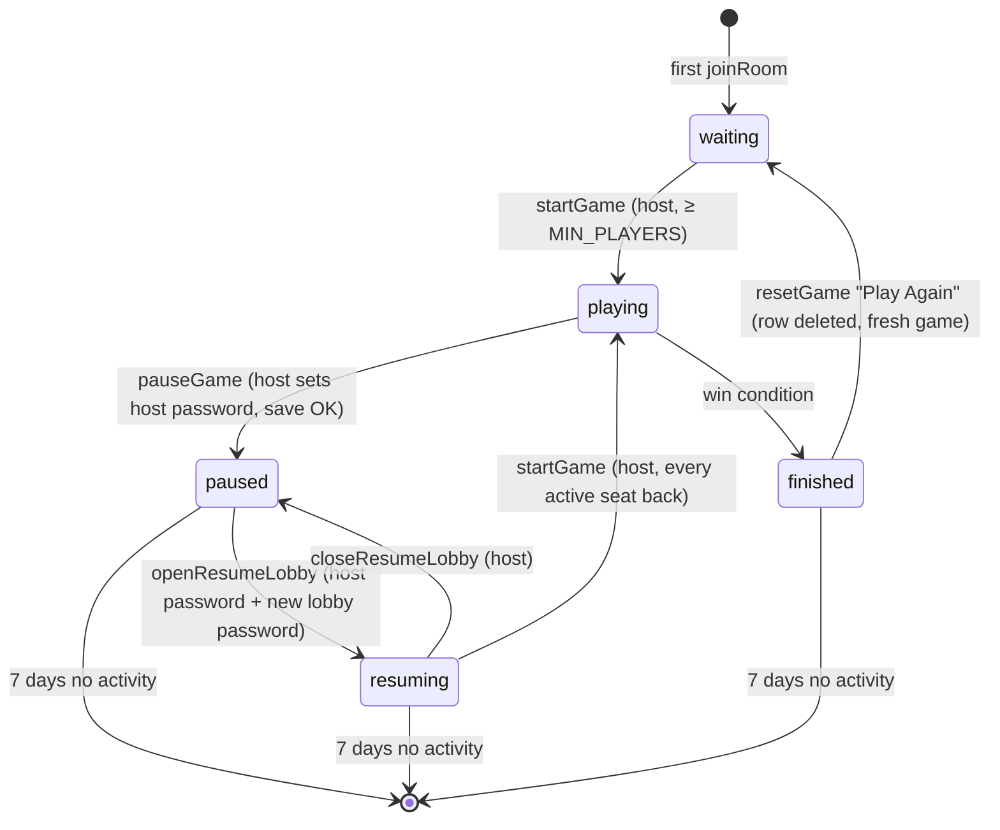

# Persistent Games: Pause, Restart, Resume Lobby, 7-Day Expiry

Status: **plan — decisions recorded (§13); D3 (autosave) awaiting a yes/no.**

Goal: the host can pause a game, the server can restart, and days later the
host reopens the game as a password-protected lobby that every original
player rejoins, continuing exactly where they left off. Games with no
meaningful activity for 7 days are deleted server-side.

---

## 1. What exists today (inspected)

| Concern | Current implementation | File |
|---|---|---|
| Game state | One in-memory `GameRoom` object per room; plain JSON-able data | `common/types/Room.ts` |
| Room registry | `gameRooms: Map<string, GameRoom>` | `backend/src/store.ts` |
| Room creation | Client generates a 6-char code; first `joinRoom` creates the room | `ui/src/pages/Lobby.tsx`, `handlers/room.ts` |
| Room removal | Empty lobby deleted on disconnect; idle sweep every 15 min deletes rooms idle > 4 h | `handlers/room.ts`, `roomSweep.ts` |
| Lifecycle | `gameStatus: 'waiting' \| 'playing' \| 'finished'` | `Room.ts` |
| Host | Implicit: `room.players[0]`, checked by comparing `socket.id` | `handlers/room.ts` |
| Player identity | Name (unique per room) is the identity inside game state (`turnState.playerOrder`, soldier/settlement `owner`); a random **seat token** re-attaches a reload | `handlers/room.ts` |
| Reconnect | `joinRoom` with token re-attaches; tokenless join to a started game → rejoin picker of offline seats or spectate | `handlers/room.ts`, `pages/RejoinPicker.tsx` |
| Action validation | Every action handler resolves caller by `socket.id` and calls `blockIfCannotAct` | `handlers/context.ts` |
| Event contract | Typed `ClientToServerEvents` / `ServerToClientEvents` | `common/types/SocketEvents.ts` |
| "Activity" | `lastActivityAt` set inside **every** `broadcastRoom` — including connect/disconnect | `broadcast.ts` |
| Database | None. `mongoose` is in `backend/package.json` but **unused** (no import, no server) | — |
| Tests | None, no test runner | — |
| Deploy | Single Docker container, single Node process, on the home server; compose file lives in `/opt/catan` (not in repo). Deploy doc already anticipates "persistence to `/data`" | `plans/PUBLIC_DEPLOYMENT.md` |

Implications:

- **Single process, synchronous handlers.** No multi-instance coordination is needed.
- The game state is already a plain data aggregate, so it can be snapshotted as a whole. Only a few runtime fields must be stripped.
- Returning players are identified by **link + password + picking their seat**, not by anything stored in the browser. Device changes and cleared storage don't matter, and no long-lived browser token is needed.
- `lastActivityAt` currently treats reconnects as activity. That has to change (§9).

## 2. Lifecycle

Extend the existing status union rather than adding a parallel flag:

```ts
type GameStatus = 'waiting' | 'playing' | 'paused' | 'resuming' | 'finished';
```

- `waiting`: new-game lobby (unchanged).
- `playing`: active game (unchanged).
- `paused`: saved to the database and evicted from memory. No gameplay.
- `resuming`: a reopened lobby holding the saved state. Lobby password required; only the saved seats.
- `finished`: game over (unchanged).
- Deletion is not a status: the row is removed.



All transitions go through one function, `transition(room, to, actor)`, in `lifecycle/gameLifecycle.ts`. It holds an explicit allowed-transition table and the host check. Handlers never assign `gameStatus` directly; the existing assignments (`room.ts` ×2, `score.ts`) move behind it.

`blockIfCannotAct` becomes "status must be `playing`". This one change blocks every gameplay action while paused or resuming, because all action handlers already call it (verified: build, soldier, trade, devCards, battle/*, turn/*).

Timestamps on the persisted row: `created_at`, `updated_at`, `last_activity_at`, `paused_at`, `resumed_at`, `completed_at`.

## 3. Runtime vs persistent state

| `GameRoom` / `Player` field | Persist? | Notes |
|---|---|---|
| `board` (hexes, vertices, edges, settlements, roads, soldiers, robber) | ✅ snapshot | |
| `turnState` (phase, order, offset, dice owner, per-turn soldier lists, undo log) | ✅ snapshot | |
| `roll`, `robberMove`, `robberDefeatedBy`, `steal`, `devCardChoice`, `discards` | ✅ snapshot | Pending actions survive a pause |
| `battleState` | ✅ snapshot | Plain data; a battle resumes mid-round |
| `tradeOffers` | ✅ snapshot | |
| `devCardDeck` (order) | ✅ snapshot | Never sent to clients; stays server-side |
| `robberBag`, `bankSupply`, `battlesWon`, `pointsToWin`, `winner` | ✅ snapshot | |
| `bonuses` | ✅ snapshot | **Must** persist: `applyBonuses` adjusts VP by diffing against the previous bonuses, so dropping them would double-count VP |
| `players[]`: name, color, resources, devCards, VP, eliminated, freeRoadsLeft, devCardsBoughtThisTurn | ✅ snapshot (array order preserved: seat order = host order) | |
| `players[].token` (seat token) | ❌ runtime | Re-issued when a seat is claimed; only used for reloads within a session |
| `players[].id` (socket id), `connected` | ❌ runtime | Reset to `''` / `false` on load |
| `spectators` | ❌ runtime | |
| `lastActivityAt` (in-memory sweep) | ❌ runtime | The DB has its own `last_activity_at` |
| RNG | — | `Math.random`, no seed exists; the deck order is the only randomness with future effect, and it's persisted |

## 4. Schema (SQLite): one table

```sql
-- migration 1
CREATE TABLE games (
  id                  TEXT PRIMARY KEY,          -- room code (the link stays the same)
  status              TEXT NOT NULL CHECK (status IN ('playing','paused','resuming','finished')),
  host_name           TEXT NOT NULL,             -- seat name of the host
  host_password_hash  TEXT NOT NULL,             -- scrypt; set by the host when pausing
  lobby_password_hash TEXT,                      -- scrypt; set at "Start Lobby Again", NULL while paused
  state_version       INTEGER NOT NULL,          -- snapshot shape version (starts at 1)
  state_json          TEXT NOT NULL,             -- serialized snapshot (§3)
  version             INTEGER NOT NULL DEFAULT 1,-- optimistic lock, +1 on every write
  created_at          INTEGER NOT NULL,
  updated_at          INTEGER NOT NULL,
  last_activity_at    INTEGER NOT NULL,
  paused_at           INTEGER,
  resumed_at          INTEGER,
  completed_at        INTEGER
);
CREATE INDEX games_last_activity ON games(last_activity_at);
```

Why this shape:

- **Columns** hold everything the server queries or authorizes on before loading the game: status, host, both password hashes, timestamps, version.
- **The game state stays one JSON snapshot.** It's a single aggregate, always loaded and saved whole, and never queried piecewise. Normalizing roads, soldiers and so on into tables would add a mapping layer with no query benefit, and would make every rules change a schema migration.
- **No seats table:** seats are listed from the snapshot after the lobby password is accepted, and nothing looks a seat up by credential.
- The schema is versioned with `PRAGMA user_version` and numbered migrations run at boot. The snapshot is versioned with `state_version`, and `gameSnapshot.ts` keeps a `migrate(state, fromVersion)` hook (just identity for v1).

Durability settings: `journal_mode=WAL`, `synchronous=FULL`. The DB file lives in `DATA_DIR`: default `./data` in dev, `/data` in the container, which needs a volume mount in `/opt/catan/docker-compose.yml` (a deployment step outside this repo).

## 5. Module layout (backend)

```text
backend/src/
  persistence/
    db.ts              open DB, pragmas, run migrations
    gameRepository.ts  only place with SQL; all queries parameterized
    gameSnapshot.ts    GameRoom ⇄ snapshot (strip runtime fields, validate, version, migrate)
  lifecycle/
    gameLifecycle.ts   transition table + host/password checks; pause / openLobby / closeLobby / start
    passwords.ts       scrypt hash / verify (constant-time), attempt limiter
    activity.ts        touch(room): the single place meaningful activity is recorded
  handlers/room.ts     thin: parse payload → call lifecycle service → broadcast
  roomSweep.ts         + hourly DB expiry pass
```

Flow: `Socket handler → gameLifecycle → gameRepository → SQLite`. Handlers never touch SQL.

Repository API: `saveSnapshot(room, fields, expectedVersion)`, `load(id)`, `getMeta(id)` (status, host, timestamps, hashes, version; no state), `updateStatus(id, status, expectedVersion, fields)`, `touchActivity(id, at)`, `deleteExpired(cutoff)`, `delete(id)`.

## 6. Flows

### Pause (host)

1. Client: the ☰ menu (host only) shows "Pause Game…". The dialog explains that gameplay stops and the state is saved, and asks the host to **set a host password** (with confirm). This is what proves they're the host when they come back, from any device.
2. Server `pauseGame {roomId, hostPassword}`:
   1. The caller must be the host seat and the status must be `playing`. The password must be 6–128 characters.
   2. Hash the password (scrypt), then serialize and validate the snapshot.
   3. In one transaction, upsert the row, setting `status='paused'`, `host_password_hash`, `paused_at`, `last_activity_at` and `version+1`, and clearing `lobby_password_hash`.
   4. **Only after the commit succeeds**, set the in-memory status to `paused`.
   5. Broadcast the final state (status `paused`, host name, game ID, saved time, expiry).
   6. Remove the sockets from the room and evict the room from `gameRooms`.
3. If the save fails: no state change, the game keeps running, and the host gets an error ("Couldn't save the game — it's still running").
4. Players see a **Game Paused** screen built from the server state: host name, game ID, saved time, "Deleted after 7 days of inactivity: expires <date>", and "You can close this page."

### Coming back to a paused game (any device, after restarts)

Everyone uses **the same link** (`/join?id=CODE`). `joinRoom` for a code that isn't in memory checks the DB and sends `pausedGameInfo` (host name, game ID, paused and last-activity times, expiry). Nobody sees the state or the seat list yet.

The paused screen shows two things:

- **"I'm the host": Start Lobby Again** is a form with:
  - the host password
  - a **new lobby password** for players, plus confirm
- **Players:** "Waiting for <host> to reopen the game", and you can leave the page open. When the host reopens it, the page switches to the password step on its own, because the server pushes the status change to sockets watching that code.

Creating a new room is refused for any code held by a saved game, so codes can't collide.

### Start Lobby Again (host)

Server `openResumeLobby {roomId, hostPassword, lobbyPassword}`:

1. The status must be `paused` and the host password must verify. A wrong password counts toward the attempt limit (§11).
2. Hash the lobby password, load the snapshot into memory with every seat `connected:false`, and **seat the caller as the host**.
3. Set `status='resuming'` and `resumed_at`, and touch activity. All in one versioned update.
4. Host sees the **resume lobby**:
   - game ID and the expiry note
   - every seat, with color, ✅ back or ⏳ away (knocked-out seats marked)
   - **Start Game**, disabled until every active seat is back
   - **Close lobby** (back to paused)

If the host forgets the host password, the game can't be reopened and expires after 7 days. The pause dialog says so.

### Rejoining the resume lobby (players)

1. The player opens the link and sees the **lobby password** prompt.
2. The server checks it (`unlockResumeLobby`) and sends the seats not yet claimed. The existing `RejoinPicker` is reused.
3. The player picks their seat (`claimSeat {roomId, name, password}`). The password is re-checked on the claim itself, so the picker can't be skipped.
4. The player is back with their color, resources, cards, buildings and VP, all from the snapshot.
5. **No duplicates:** a seat that's already claimed is never offered, and two simultaneous claims of one seat resolve to the first. **New players:** none; anyone else may only spectate.
6. **Reloads** during the session use the existing seat token, so a refresh doesn't ask for the password again.

### Start (host)

`startGame` in `resuming` requires **every seat that isn't knocked out** to be back. Knocked-out seats can't take turns anyway, so they aren't required and don't block the game forever. Then:

1. Transition to `playing`. The snapshot is untouched, so no new game is created.
2. Touch activity.
3. The game continues exactly where it was paused.

If someone disconnects after Start, the existing offline/rejoin behavior applies, with the lobby password required to claim a seat in a saved game.

## 7. Socket events (camelCase, matching the existing contract)

Client → server:

- `pauseGame {roomId, hostPassword}`
- `openResumeLobby {roomId, hostPassword, lobbyPassword}`
- `closeResumeLobby {roomId}`
- `unlockResumeLobby {roomId, password}` → `rejoinOptions`
- `claimSeat {roomId, name, password?}`: existing event; the password is required for saved games
- `startGame`: existing, now also valid in `resuming`

Server → client:

- `roomUpdate` / `gameUpdate`: existing, carry the new statuses
- `pausedGameInfo {roomId, hostName, pausedAt, lastActivityAt, expiresAt, status}`: sent when the room isn't in memory, and pushed when a paused game opens or closes its lobby
- `gameExpired {roomId}`

All payloads are added to `SocketEvents.ts`. `PublicGameRoom` gains `pausedAt`, `lastActivityAt` and `expiresAt`, and **never** a password hash or the deck order.

## 8. Host identity

- **Who:** `host_name` is stored at pause and equals `players[0].name`. Seat order is persisted, so `players[0]` stays the host after resume.
- **Proof after a pause:** the host password. In a live game, the host's seat (socket) is enough, as today.
- **One host:** there's one host per row and no host transfer. If the host never returns, the game expires.

## 9. Activity and expiry

**Activity** means `last_activity_at` is updated by `touch(room)`, and only from:

- the game moving to playing, paused, resuming or finished
- a seat claimed in the resume lobby
- a turn or phase advance
- a successful gameplay action: build, trade, battle resolution, dev card played

**Not activity:**

- socket connect or disconnect
- seat-token re-attach
- opening the link or viewing the paused screen
- wrong passwords, failed or rejected actions
- spectating
- Socket.IO pings (they never reach handlers)

`broadcastRoom` stops setting `lastActivityAt`. The in-memory 4-hour sweep reads the same `touch` timestamp, so a reconnect loop can no longer keep a room alive.

**Expiry job:** inside the existing `roomSweep.ts` interval, hourly.

1. `DELETE FROM games WHERE last_activity_at < now − 7 days RETURNING id`.
2. For each returned id still in memory: emit `gameExpired` to its sockets, evict it, and log one line per game.
3. The delete is conditional, so running it twice is a no-op (idempotent).
4. An expired code can't be resumed or joined. It becomes free for a brand-new game.

Expiry is shown on the paused screen and the resume lobby as "Last activity <date> · Deleted <date> unless resumed", computed from server timestamps.

## 10. Races and atomicity

| Race | Resolution |
|---|---|
| Pause while an action is processing | Handlers are synchronous, and the SQLite driver is synchronous. Each event runs to completion before the next, so whichever arrives first wins entirely, and the other is rejected by the lifecycle gate. Password hashing (scrypt) runs before the state is touched, and the pause re-checks the status after it. |
| Two resume requests | The first moves `paused`→`resuming` with `WHERE version=?`; the second sees the new status or version and is rejected. |
| Cleanup during resume | The delete is conditional on `last_activity_at < cutoff`; resume touches activity and bumps the version in the same synchronous step. They can't interleave in one process. |
| Two hosts | One `host_name` value; only someone with the host password can open the lobby. |
| Two players claim one seat | Claims are synchronous; the second sees the seat as connected and is refused, then gets fresh options. |
| Server killed during a save | The row is written in one transaction (WAL + `synchronous=FULL`). A crash leaves the previous committed row intact, and in-memory status only changes after the commit. |
| Second server process | Out of scope; the deploy is one container. Optimistic `version` checks reject stale writers anyway. |

## 11. Security

- **Host-only actions:**
  - Pausing requires being the host's live seat.
  - Opening or closing the lobby needs the host password.
  - Starting requires being the host's seat.
  - The client hiding a button is cosmetic only.
- **Passwords:**
  - Both are scrypt (`crypto.scrypt`, built in) with a random salt, compared in constant time.
  - Hashes never leave the repository layer.
  - 6–128 characters.
- **Guessing limit:**
  - 5 wrong attempts per socket, then a 60-second lockout.
  - Plus a per-room cap of 30 wrong attempts per 10 minutes, so reconnecting to reset the counter doesn't help.
  - scrypt's cost slows each guess further.
- **A saved game's code alone reveals only** the host name, game ID and timestamps. The seat list needs the lobby password; the state needs a claimed seat.
- **No client state is trusted:** the server rebuilds state only from the DB, and clients never send state.
- **Parameterized SQL only.** The lifecycle gate runs on every action; the client can't influence expiry, because activity is computed server-side.

## 12. Client UI

- **☰ menu:** host gets "Pause Game…" with a confirm dialog and a host password + confirm field ("You'll need this to reopen the game — it can't be recovered").
- **`PausedScreen`:**
  - host name, game ID, saved time, expiry
  - a "Start Lobby Again" form: host password, new lobby password + confirm
  - a "waiting for <host>" note for everyone else
- **`ResumeLobby`:**
  - game ID and expiry
  - seat list with colors and ✅ back / ⏳ away / 💀 knocked out
  - Start Game (host), disabled with "Waiting for: …" until everyone is back
  - Close lobby (host)
- **Rejoin:** a lobby password step in front of the existing `RejoinPicker`.
- **Routing in `GameLogic`:** chosen from server status only (`pausedGameInfo`, `resuming`, `playing`), never from local flags.

## 13. Decisions

| # | Decision | Status |
|---|---|---|
| D1 | **SQLite via Node's built-in `node:sqlite`** (no new dependency). Needs Node ≥ 22.13 in the container. Fallback: `better-sqlite3` if the image's Node is older. Remove unused `mongoose`. | Default (no objection) — confirm the container Node version at deploy |
| D2 | **Host proves identity with the same link + a host password set when pausing.** No browser-stored tokens; works from any device. A forgotten host password means the game expires. | ✅ Decided |
| D3 | **Autosave during play** (see below) | ⏳ Your call |
| D4 | **Everyone must come back before Start** (all seats not knocked out). | ✅ Decided |
| D5 | **Tests with Node's built-in `node:test`**, under `backend/test/`. | Default (no objection) |

### D3: is saving every turn too much load?

No. I measured it on this repo's own state with a 4-player dev-preset game (more pieces than a normal game):

| Measure | Result |
|---|---|
| Snapshot size | **31 KB** |
| Serialize + durable write (`synchronous=FULL`, WAL) | **0.13 ms per save** |
| Saves per game | one per turn advance: a few hundred over a long game |

That's well under a millisecond of work every few seconds or minutes. Even on a much slower home-server disk the cost is negligible next to one socket broadcast, which already serializes the same room once per player on every action.

What autosave buys: today, a server restart or crash mid-game loses the game, or rolls it back to the last pause. With autosave, the game would come back paused at the last turn boundary.

It only applies to games that have been paused at least once, since that's when a host password exists to reopen them. On boot, any `playing` or `resuming` row becomes `paused`.

**Options:** (a) autosave every turn as described; (b) save only on pause, exactly as the original spec says.

## 14. Implementation phases

1. **Persistence:** `db.ts` (pragmas, migrations), repository, snapshot serializer with a round-trip validator, `DATA_DIR` config, removing the unused `mongoose`.
2. **Lifecycle:** status union, `transition()` table, the `blockIfCannotAct` gate, explicit host, `touch()` activity, the `broadcastRoom` change, and pause / open / close / start / claim handlers with typed events.
3. **Passwords and rejoin:** scrypt hashing, the attempt limiter, the saved-game lookup in `joinRoom`, the password-gated unlock and claim, and the everyone-back rule.
4. **UI:** pause dialog with host password, paused screen with the Start Lobby Again form, resume lobby with the seat checklist, lobby password step, expiry display.
5. **Expiry:** sweep pass, `gameExpired`, logging; plus D3 autosave if chosen.
6. **Tests:**
   - **Unit, in-memory DB plus a fake clock:**
     - snapshot round-trip on a preset board, including pending discards, a battle and a knight choice
     - pause: host vs non-host, short password rejected, a failed save leaves the game playing
     - reopen: wrong host password, right host password, and a non-host can't open
     - lobby: wrong or right lobby password, the claim re-checks the password, no duplicate seats
     - start: blocked until every active seat is back; a knocked-out seat doesn't block
     - expiry: 7-day cutoff, active games kept, reconnects and paused-screen views don't refresh activity, idempotent
     - concurrency: double reopen, cleanup vs reopen, double claim, a version conflict
     - crash mid-transaction: the previous state stays intact
   - **E2E script (§15):** a real server process, socket.io clients, and a `kill -9` restart.

## 15. Acceptance test (scripted, real processes)

```text
Alice creates, Bob joins, game starts, a few turns played
→ Alice pauses, host password "castle-key" → DB row status=paused
→ server process killed (SIGKILL) and restarted
→ Alice opens the same link (fresh browser, nothing stored)
  → wrong host password rejected → right one + lobby password "hunter22" → resume lobby
→ Bob opens the same link (fresh browser) → wrong lobby password rejected → right one → picks Bob
→ Start Game enabled only now that both seats are back → Alice starts → status=playing
→ full GameRoom (minus runtime fields) deep-equals the state captured before pause
```

Expiry check:

- Fake clock + 7 days and one sweep → the row is gone, the link shows "game not found", reopening is impossible.
- A second sweep is a no-op.
- Opening the link and reconnecting during the 7 days don't extend the expiry.

## 16. Out of scope

- Multiple server instances or shared storage.
- Host transfer, or recovering a forgotten host password.
- Accounts or login.
- Persisting games that were never paused.
- Changing the existing link-based rejoin for games that were never paused.
