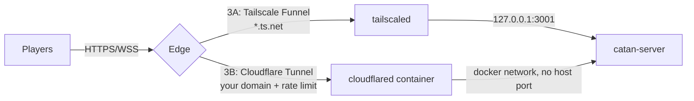

# Public Deployment Plan — Risky Reign

Goal: anyone with the URL can play; nothing else on `jia-server` is reachable,
and a hostile player can at worst end their own session — not the server,
not other games, not the box.

Sources: host audit of `jia-server` and a code security review of this repo
(2026-09-26). Findings F1–F11 cite exact file:line evidence in that review.

---

## 0. Current state (audited)

| Area | State | Verdict |
|---|---|---|
| App binding | `100.127.5.96:3001` (tailnet) + `192.168.8.208:3001` (LAN playtest) | OK |
| Container | non-root `node`, read-only rootfs, `no-new-privileges` | OK |
| Container limits | `cap_drop: ALL`, 512 MB, 1.5 CPU, 128 pids (applied 2026-09-26) | OK |
| Docker logs | `json-file`, rotated 10 MB × 3 (applied 2026-09-26) | OK |
| ufw | default-deny; only `3001/tcp` from `192.168.8.0/24` (dead rules removed 2026-09-26) | OK |
| SSH | **no sshd installed**; access is Tailscale SSH (`RunSSH: true`) | OK, reduce scope |
| OS updates | unattended-upgrades on, 0 security updates pending | OK |
| Tailscale | v1.102.4, key expiry 2027-03-24, Funnel **not enabled** in ACL | — |
| Game code | **F1 crash reproduced** — one empty `joinRoom` exits the server | ❌ blocker |

**Corrections to the previous version of this plan:**
- `4164/udp` is wrong; Tailscale listens on **`41641/udp`** and already admits
  itself via its own `ts-input` iptables chain. The ufw rule is dead weight.
- `22/tcp` is dead weight: no sshd is installed.
- **Docker bypasses ufw.** Published ports are DNAT'd in the `DOCKER` chain
  before ufw's INPUT rules run. The `3001/tcp` LAN rule is not what protects
  the LAN binding — the private address is. Never rely on ufw for Docker ports;
  control exposure with the bind address (or with no published port at all).
- **Funnel cannot use a custom domain** — `*.ts.net` only, ports 443/8443/10000,
  still beta. A custom domain requires Cloudflare Tunnel (Phase 3B).

---

## Architecture decision



Both edges are **outbound-only**: no router port forwarding, home IP hidden.

| | 3A Tailscale Funnel | 3B Cloudflare Tunnel |
|---|---|---|
| Cost | free | free (+ ~$10/yr domain) |
| URL | `https://jia-server.tailfb115d.ts.net` | `https://riskyreign.com` |
| Edge rate limiting / WAF | none | 1 free rate-limit rule, bot fight mode |
| Real client IP | `X-Forwarded-For` | `CF-Connecting-IP` |
| Host port needed | `127.0.0.1:3001` | **none** (container network) |
| Status | beta | GA |

**Recommendation:** start with **3A** for the first public weekend (zero cost,
one command, one-command rollback). Move to **3B** once you want a real domain
or see abuse — edge rate limiting is the only thing 3A can't give you.

---

## Phase 1 — Home LAN playtest (active now)

Open `http://192.168.8.208:3001` from any device on the home WiFi.

- [ ] UI loads, board renders
- [ ] 2+ players join one room and complete full turns
- [ ] Trade, robber, dev cards, battle each exercised once
- [ ] Note bugs to fix before Phase 2

---

## Phase 2 — Hardening (all required before any public exposure)

### 2A. App fixes — in this repo, pushed, deployed with `server riskyreign update`

Ordered by risk removed per effort. **2A-1 through 2A-4 are blockers.**

- [ ] **2A-1 Crash guard (F1, Critical — reproduced).** One empty
      `socket.emit('joinRoom')` exits Node (exit 1, all games lost).
      In `backend/src/sockets.ts`, register every listener through a wrapper:
      reject non-object payloads, `try/catch` the handler, emit a generic
      `error` to the caller. Add `process.on('uncaughtException')` as a logged
      backstop. Longer term: zod schemas per event.
- [ ] **2A-2 Resource caps (F4, High).**
      `new Server(server, { maxHttpBufferSize: 16_000 })`;
      validate layouts **before** `createGameRoom` (≤100 hexes, integer
      coords `|q|,|r|,|s| ≤ 10`, `q+r+s===0`); cap total rooms (~500);
      delete rooms with no connected sockets after 30 min (disconnect handler
      is currently empty, `gameRooms` never shrinks); cap `tradeOffers` (≤20);
      per-socket token-bucket event limit; per-IP connection limit keyed on
      `X-Forwarded-For` (3A) or `CF-Connecting-IP` (3B) with
      `app.set('trust proxy', 1)`.
- [ ] **2A-3 Seat ownership (F2, High).** `joinRoom` re-binds a seat by
      **name match only**, before the started/full checks — anyone with the
      code can steal a seat mid-game. Issue a `crypto.randomBytes(16)` reconnect
      token on first join (stored client-side), require it to re-attach.
- [ ] **2A-4 Admin authorization (F3, High).** `startGame`, `resetGame`,
      `updatePointsToWin`, `exitBattle` have no membership check — any socket
      that knows a code can wipe a running game. Add the same
      `room.players.some(p => p.id === socket.id)` guard `refreshMap` uses;
      restrict start/reset to host; require `gameStatus` preconditions.
- [ ] **2A-5 Room codes (F7).** Generate server-side with `crypto.randomInt`,
      ≥10 chars, no look-alike characters. `joinRoom` joins only (no implicit
      creation). One generic "Room not available" error (current distinct
      "not found" / "not a member" messages are an existence oracle).
- [ ] **2A-6 Input validation (F6, F8).** Names: string, 1–24 printable chars,
      reject `__proto__`/`constructor`/`prototype`. Colors:
      `/^#[0-9a-fA-F]{6}$/` or `PLAYER_COLORS` (today `url(...)` makes every
      opponent's browser fetch an attacker URL). All ID lookups via
      `Object.hasOwn` — `moveRobber('__proto__')` currently pollutes
      `Object.prototype` process-wide.
- [ ] **2A-7 Hidden state (F5).** Every update broadcasts the raw room,
      including `devCardDeck` in draw order and every hand. Emit a per-socket
      `viewFor(room, socketId)`: deck length only, opponents' hands as counts,
      no socket ids.
- [ ] **2A-8 HTTP layer (F9).** `app.disable('x-powered-by')`; `helmet` with
      CSP `default-src 'self'` and `frame-ancestors 'none'`; set
      `CORS_ORIGIN` to the public hostname and drop `app.use(cors())`;
      build UI with `GENERATE_SOURCEMAP=false`.
- [ ] 2A-9 (low) Undo floor check after robber fight (F10); `crypto.randomInt`
      for dice and shuffles (F11).

### 2B. Container hardening — `/opt/catan/docker-compose.yml` ✅ applied 2026-09-26

```yaml
    cap_drop: [ALL]
    mem_limit: 512m
    cpus: "1.5"
    pids_limit: 128
    logging:
      driver: json-file
      options: { max-size: "10m", max-file: "3" }
```

Effect: a flood can exhaust the container, not the host (SSH, Tailscale, and
the desktop stay up); logs are capped at 30 MB.

### 2C. Host hardening — `jia-server`

- [ ] **Rotate the sudo password** (it was shared in a chat session).
- [x] Clean ufw: removed dead `4164/udp` and `22/tcp` rules (2026-09-26).
      Default-deny kept; only the LAN playtest rule `3001/tcp` remains.
- [ ] (deferred by owner) Remove `jia` from the `docker` group (`sudo gpasswd -d jia docker`);
      the `server` command then runs its docker calls via `sudo`. Docker group
      membership is root-equivalent.
- [ ] Restrict Tailscale SSH in the ACL to your own devices only.
- [ ] (deferred by owner) Disable unneeded network daemons: `cups-browsed`, `avahi-daemon`,
      `wsdd` (listening on every interface including tailnet). Not reachable
      via Funnel, but less to patch.
- [ ] Reserve a static DHCP lease for `192.168.8.208` in the router.

---

## Phase 3A — Go public: Tailscale Funnel

1. Tailscale admin console → Access controls → add the `funnel` node attribute
   for `jia-server` (currently absent).
2. Re-bind the app to loopback only (Funnel proxies to localhost; the tailnet
   and LAN bindings are no longer needed):
   ```yaml
   ports:
     - "127.0.0.1:3001:3001"
   ```
   `docker compose up -d`
3. Enable (persists across reboots):
   ```
   sudo tailscale funnel --bg 3001
   sudo tailscale funnel status
   ```
   Public URL: `https://jia-server.tailfb115d.ts.net`
4. Set `CORS_ORIGIN=https://jia-server.tailfb115d.ts.net` in compose.

Rollback: `sudo tailscale funnel reset` — back to private instantly.

## Phase 3B — Go public: Cloudflare Tunnel (custom domain)

1. [x] `riskyreign.com` registered on Cloudflare Registrar 2026-09-27
   (expires 2027-09-27, $10.46/yr at-cost; NS `celine`/`cleo.ns.cloudflare.com`).
2. [x] Tunnel `riskyreign` created (id `88277e44-a865-4978-8c06-6f65045c7809`).
   Public hostname `riskyreign.com` → HTTP `catan:3001`; Cloudflare DNS
   record live (proxied). Until a connector runs, the domain answers **530**.
3. [x] Token stored in `/opt/catan/.env` (`chmod 600`, gitignored).
   - [ ] **Refresh the token before go-live** — the current one was pasted in
     a chat. Tunnels → riskyreign → Refresh token, then replace the value in
     `.env`.
4. [x] `cloudflared` service added to `/opt/catan/docker-compose.yml` as
   container `catan-tunnel`: pinned `cloudflare/cloudflared:2026.9.3`,
   read-only, `cap_drop: ALL`, 128 MB, rotated logs.
   It sits behind compose profile **`public`**, so plain `docker compose up`
   and every `server riskyreign` command leave it **off** (verified
   2026-09-27). The game answers the tunnel at `catan:3001` on the compose
   network (verified: HTTP 200 + socket.io handshake).
5. [ ] Cloudflare dashboard: SSL/TLS **Full**; Security → Bots → Bot Fight Mode on;
   one rate-limit rule (e.g. 60 req / 10 s per IP on `/socket.io/*`).

### Go-live switch (only after Phase 2A blockers + token refresh)

1. In `docker-compose.yml`, `catan` service:
   - delete the whole `ports:` block (the tunnel becomes the only way in),
   - set `CORS_ORIGIN=https://riskyreign.com`.
2. `cd /opt/catan && docker compose --profile public up -d`
3. Confirm: `docker logs catan-tunnel` shows `Registered tunnel connection`
   (four of them), and `https://riskyreign.com` returns the game instead of 530.

Rollback: `docker compose --profile public stop cloudflared` — the domain
returns 530 immediately; the game keeps running privately.

---

## Phase 4 — Verify before announcing

From a phone on **cellular** (outside the home network):

- [ ] UI loads over HTTPS, valid certificate
- [ ] Two players in one room, one on cellular — WebSocket stays connected
- [ ] `curl -I https://<public-host>/` has no `X-Powered-By`, has CSP
- [ ] `https://<public-host>/static/js/*.map` → 404
- [ ] Crash regression: empty `joinRoom` emit → error event, server stays up
- [ ] Unknown room code → generic error, no room created
- [ ] From the internet, nothing else answers: only 443 on the public host;
      `192.168.8.208:3001` and `100.127.5.96:3001` no longer bound (3A/3B)
- [ ] `docker inspect catan-server` shows memory/pids limits and `CapDrop=[ALL]`

## Phase 5 — Operate

`server` (menu) or `server rr <command>` (`rr` = `riskyreign`):

| Command | What it does |
|---|---|
| `status` | Running/stopped, version vs repo, players connected, CPU/memory, whether riskyreign.com answers, pending update |
| `logs [game\|tunnel\|deploy\|all] [-f] [N]` | Game log by default; `-f` follows live (Ctrl-C returns to the menu) |
| `update [--force] [--yes]` | Pull + build; applies now if nobody is playing, otherwise when games end. `--force` applies immediately and ends current games |
| `start` / `restart` / `close` | `restart` asks first if players are connected; `close` takes the site offline before stopping the game |
| `public on\|off` | Start/stop the Cloudflare tunnel; the game keeps running locally either way |

- Deploy: `server rr update` — never drops a game in progress:
  - **Builds from committed files only** (`git archive HEAD`), never the
    working tree. Leftover `node_modules`/`dist` in `/opt/catan` once made the
    build compile against stale `common` code (2026-09-27); that can't recur.
    The compose file has no `build:` section, so `docker compose` can't
    build from the working tree either.
  - Pulls and builds while the current server keeps running; a failed build
    leaves the running server untouched.
  - No players connected → applies immediately.
  - Players connected → a background waiter applies the new build once
    **no players have been connected for 5 min** or **no game action has
    happened for 60 min** (idle tabs only send heartbeats; any move resets
    the timer). Watch: `server rr logs deploy -f`.
  - `server rr close` cancels the wait; the next `start` runs the new build.
  - **Force:** `server rr update --force` (menu item 4) skips the wait and
    applies right away, cancelling any pending waiter. If players are
    connected it asks first; from scripts it refuses unless `--yes` is added.
    The deploy log records it as `applied … (FORCED, N connected)`.
  - Tunables (env): `RR_EMPTY_SECS` (300), `RR_IDLE_SECS` (3600), `RR_POLL` (30).
  - Player detection works through the tunnel: it holds one connection per
    player to the container (verified 2026-09-27, 2 players seen via riskyreign.com).
- Incident: `server rr public off` (site offline in seconds, games keep
  running privately), then `server rr logs`, fix, `server rr update`.
  In-memory state resets on restart — expected until persistence to `/data` exists.

## Residual risk (accepted)

- No accounts: room code + reconnect token are the only credentials.
- In-memory state: any restart ends all games.
- Single home box: ISP or power outage = downtime.
- 3A has no edge rate limiting; app-level limits (2A-2) are the only brake.
