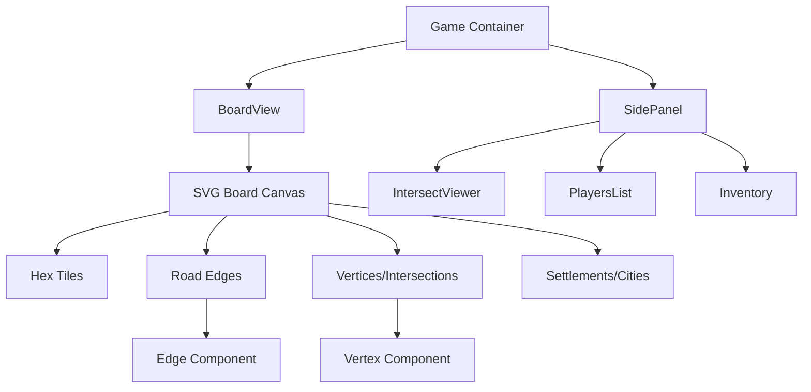
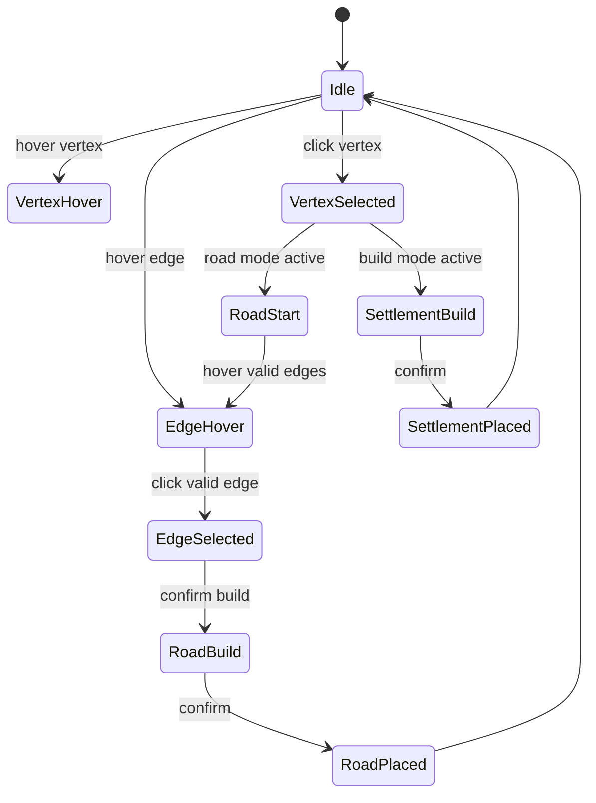

# RiskyReign Board UI Redesign Plan

## Overview
Modern Catan-style board redesign with interactive vertex clicking for settlement building and connector edge selection for road building. Supports flexible data types.

## Current State Analysis

### Existing Components
- [`frontend/src/containers/CatanBoard.tsx`](frontend/src/containers/CatanBoard.tsx:25)
- [`frontend/src/components/Intersection.tsx`](frontend/src/components/Intersection.tsx:23)
- [`frontend/src/components/Road.tsx`](frontend/src/components/Road.tsx:8)
- [`frontend/src/containers/IntersectViewer.tsx`](frontend/src/containers/IntersectViewer.tsx:15)

### Current Data Model
```typescript
// From common/types/Board.ts
interface IntersectNode {
  coord: PixelCoord;
  intersections: Set<number>;
  id: number;
  settlement: number | null;
  soldiers: SoldierObj[];
  roads: Set<number>;
}

interface RoadObj {
  id: number;
  intersect1: number;
  intersect2: number;
  owner: string;
  coord1: PixelCoord;
  coord2: PixelCoord;
  upgraded: boolean;
}
```

## New UI Architecture

### 1. Data Model Flexibility
Support both vertex-based and edge-based data types:

```typescript
type VertexId = number | string;
type EdgeId = number | string;

interface BoardVertex {
  id: VertexId;
  coord: { x: number; y: number };
  settlement?: SettlementObj | null;
  roads: Set<EdgeId>;
  adjacentVertices: Set<VertexId>;
  hoverState: boolean;
  selected: boolean;
}

interface BoardEdge {
  id: EdgeId;
  vertexA: VertexId;
  vertexB: VertexId;
  road?: RoadObj | null;
  hoverState: boolean;
  selected: boolean;
  validForBuilding: boolean;
}
```

### 2. Component Hierarchy



### 3. Interaction Flow



## UI Design Specifications

### Visual Design
- **Board Canvas**: SVG with layers for proper z-ordering
- **Hex Tiles**: Modern flat design with resource icons and numbers
- **Vertices**: 
  - 12px dots with hover glow effect
  - Color-coded by ownership
  - Settlement icon overlay
  - 3px border for selection state
- **Edges**:
  - 4px lines with road texture
  - Dashed preview for valid placements
  - Hover highlight with 2px glow
  - Color-coded by ownership

### Interaction States

#### Vertex States
- `idle`: Normal state
- `hover`: Scale 1.2x, glow effect
- `selected`: 3px white border, pulse animation
- `valid`: Green glow for buildable
- `invalid`: Red glow for non-buildable

#### Edge States
- `idle`: Normal road line
- `hover`: Brighten, show build preview
- `selected`: Thicker line, white border
- `valid`: Dashed green preview
- `invalid`: Dashed red preview

### Build Modes

#### Settlement Build Mode
1. User clicks vertex
2. Check validity: adjacent to road, no existing settlement, distance rule
3. Show confirmation UI
4. Build on confirm

#### Road Build Mode
1. User clicks starting vertex
2. Highlight all valid adjacent edges
3. User clicks target vertex/edge
4. Validate connection to existing road or settlement
5. Build on confirm

## Component Structure

### New Components

#### [`frontend/src/components/BoardVertex.tsx`](frontend/src/components/BoardVertex.tsx)
```typescript
interface BoardVertexProps {
  vertex: BoardVertex;
  size: number;
  onClick: (id: VertexId) => void;
  onHover: (id: VertexId | null) => void;
  buildMode: 'settlement' | 'road' | null;
  currentPlayer: Player;
}
```

#### [`frontend/src/components/BoardEdge.tsx`](frontend/src/components/BoardEdge.tsx)
```typescript
interface BoardEdgeProps {
  edge: BoardEdge;
  onClick: (id: EdgeId) => void;
  onHover: (id: EdgeId | null) => void;
  buildMode: 'road' | null;
  selectedVertex: VertexId | null;
}
```

#### [`frontend/src/containers/BoardView.tsx`](frontend/src/containers/BoardView.tsx)
Central board controller managing:
- Vertex/edge selection state
- Hover states
- Build mode coordination
- Valid placement calculations

### State Management

```typescript
interface BoardUIState {
  selectedVertex: VertexId | null;
  selectedEdge: EdgeId | null;
  hoveredVertex: VertexId | null;
  hoveredEdge: EdgeId | null;
  buildMode: 'settlement' | 'road' | null;
  roadStartVertex: VertexId | null;
  validVertices: Set<VertexId>;
  validEdges: Set<EdgeId>;
}
```

## Implementation Plan

### Phase 1: Data Model Refactor
- [ ] Create flexible vertex/edge types
- [ ] Update Board types to support both models
- [ ] Create conversion utilities from IntersectNode to BoardVertex

### Phase 2: Component Development
- [ ] Build BoardVertex component with hover/selection
- [ ] Build BoardEdge component with preview states
- [ ] Create BoardView container with state management
- [ ] Implement layer ordering in SVG

### Phase 3: Interaction Logic
- [ ] Vertex click handling for settlements
- [ ] Edge selection for roads with two-step flow
- [ ] Validity checking algorithms
- [ ] Visual feedback systems

### Phase 4: Integration
- [ ] Replace CatanBoard with BoardView
- [ ] Update IntersectViewer for new state model
- [ ] Update SocketContext for new payloads
- [ ] Test with existing game logic

## Key Improvements

1. **Direct manipulation**: Click vertices/edges directly instead of side panel
2. **Visual feedback**: Real-time hover and validity states
3. **Modern aesthetics**: Flat design with subtle animations
4. **Flexible data**: Support for different board representations
5. **Better UX**: Two-step road building with visual preview
6. **Accessibility**: Keyboard navigation support
7. **Performance**: SVG layering and React memoization

## Technical Notes

- Use React state for UI state, context for game state
- Memoize vertex/edge calculations with useMemo
- Use SVG <g> groups for layer management
- Implement hit testing for precise vertex/edge selection
- Support touch devices with tap interactions
- Maintain backward compatibility with existing IntersectNode format

This is a solid architecture doc — clear phasing, reasonable data model, and the diagrams actually help. A few things worth tightening before you start Phase 1:

**Strong points**
- Good separation of concerns (BoardView as controller, dumb Vertex/Edge components)
- `VertexId`/`EdgeId` as `number | string` is a sane way to stay backward-compatible with the old `IntersectNode` numeric IDs while allowing future flexibility
- SVG layering for z-order (hex → edges → vertices → settlements) is the right call for hit-testing and visual clarity
- Phased plan is realistic and incremental rather than a big-bang rewrite

**Gaps I'd flag**

1. **Naming collision**: `BoardVertex` is both the data interface and the component (`BoardVertex.tsx` exports a component whose prop is `vertex: BoardVertex`). Works in TS but gets confusing fast — rename one, e.g. `VertexData` vs `VertexComponent`, or `BoardVertexView`.

2. **Road-building interaction is under-specified and internally inconsistent.** The state diagram says `VertexSelected → RoadStart → EdgeHover → EdgeSelected`, but the "Road Build Mode" section describes clicking a *starting vertex* then a *target vertex/edge* — two different mental models (click-an-edge vs click-two-vertices). Classic Catan UIs just let you click the edge directly; pick one flow and make the diagram and prose match.

3. **No server authority story.** Validity checks ("adjacent to road, no existing settlement, distance rule") are described as client-side only. In a multiplayer game this is a cheating/desync vector — the client should render optimistic validity for UX, but the server needs to be the source of truth, and the doc doesn't mention how `SocketContext` payloads get validated or how rejections/rollbacks are handled.

4. **Performance claim needs backing.** "SVG layering and React memoization" is asserted but there's no strategy for the classic Catan-board perf trap: hovering one vertex re-rendering the whole `VertexLayer`. Worth specifying exactly what's memoized (e.g., each `Vertex` component memoized on its own `hoverState`/`selected`, not on parent re-render) and whether hover state lives in a ref vs React state to avoid re-render storms.

5. **"Keyboard navigation support" and "Accessibility" are one-liners with no plan.** Spatial hex-grid graphs are genuinely hard to make keyboard-navigable (what's the tab order? arrow-key semantics on a graph, not a grid?). Either scope this out explicitly for v1 or sketch the actual interaction model — as written it reads like a checkbox that'll get cut under deadline pressure.

6. **No cancel/undo path.** The state diagram has no way back from `VertexSelected`/`RoadStart` to `Idle` other than completing a build — real users will misclick or change their mind (Escape key, click elsewhere, etc.).

7. **Conversion utilities are hand-waved.** "Create conversion utilities from IntersectNode to BoardVertex" is one bullet in Phase 1 but this is actually where a lot of the risk lives (id types, `Set` mutability, the old `soldiers`/`upgraded` fields that don't map cleanly to the new interfaces). I'd flesh this mapping out now rather than during implementation.

8. **No testing/rollout section.** Given this replaces a working `CatanBoard`, I'd want a note on how you verify parity (visual regression? a feature flag to run old/new side by side?) before Phase 4's full swap-in.

None of these are fatal — the bones of the plan are good — but #2 (interaction model) and #3 (server authority) are the ones I'd resolve before writing component code, since they'll change the props/state shape you're committing to in Phase 2.